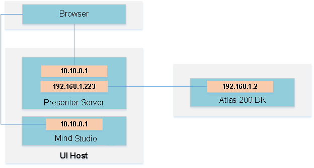

# 密集人群人数统计<a name="ZH-CN_TOPIC_0219059426"></a>

开发者将本应用部署至Atlas 200 DK或者AI加速云服务器上实现对本地mp4文件或者RTSP视频流进行解码，对视频帧中的人群图像进行人头数量的预测，并将预测的结果信息发送至Presenter Server端进行展示。

当前分支中的应用适配**1.31.0.0及以上**版本的[DDK&RunTime](https://ascend.huawei.com/resources)。

## 前提条件<a name="section137245294533"></a>

部署此Sample前，需要准备好以下环境：

-   已完成Mind Studio的安装。
-   已完成Atlas 200 DK开发者板与Mind Studio的连接，交叉编译器的安装，SD卡的制作及基本信息的配置等。

## 软件准备<a name="section8534138124114"></a>

运行此Sample前，需要按照此章节获取源码包，并进行相关的环境配置。

1.  <a name="li953280133816"></a>获取源码包。

    将[https://gitee.com/Atlas200DK/sample-crowdcounting/tree/1.3x.0.0/](https://gitee.com/Atlas200DK/sample-facedetection/tree/1.3x.0.0/)仓中的代码以Mind Studio安装用户下载至Mind Studio所在Ubuntu服务器的任意目录，例如代码存放路径为：$HOME/AscendProjects/sample-crowdcounting

2.  <a name="li8221184418455"></a>获取此应用中所需要的原始网络模型。

    参考[表 crowd\_counting中使用的模型](#table117203103464)获取此应用中所用到的原始网络模型，并将其存放到Mind Studio所在Ubuntu服务器的任意目录。例如：$HOME/models/crowdcounting。

    **表 1**  crowd\_counting中使用的模型

    <a name="table117203103464"></a>
    <table><thead align="left"><tr id="row4859191074617"><th class="cellrowborder" valign="top" width="17.32173217321732%" id="mcps1.2.4.1.1"><p id="p18859111074613"><a name="p18859111074613"></a><a name="p18859111074613"></a>模型名称</p>
    </th>
    <th class="cellrowborder" valign="top" width="9.68096809680968%" id="mcps1.2.4.1.2"><p id="p17859171013469"><a name="p17859171013469"></a><a name="p17859171013469"></a>模型说明</p>
    </th>
    <th class="cellrowborder" valign="top" width="72.997299729973%" id="mcps1.2.4.1.3"><p id="p1385991094614"><a name="p1385991094614"></a><a name="p1385991094614"></a>模型下载路径</p>
    </th>
    </tr>
    </thead>
    <tbody><tr id="row88591310124617"><td class="cellrowborder" valign="top" width="17.32173217321732%" headers="mcps1.2.4.1.1 "><p id="p13106121801715"><a name="p13106121801715"></a><a name="p13106121801715"></a>crowd_counting</p>
    </td>
    <td class="cellrowborder" valign="top" width="9.68096809680968%" headers="mcps1.2.4.1.2 "><p id="p13106171831710"><a name="p13106171831710"></a><a name="p13106171831710"></a>密集人群人数统计网络模型。</p>
    </td>
    <td class="cellrowborder" valign="top" width="72.997299729973%" headers="mcps1.2.4.1.3 "><p id="p110671813170"><a name="p110671813170"></a><a name="p110671813170"></a>请参考<a href="https://gitee.com/HuaweiAscend/models/tree/master/computer_vision/object_detect/crowd_counting" target="_blank" rel="noopener noreferrer">https://gitee.com/HuaweiAscend/models/tree/master/computer_vision/object_detect/crowd_counting</a>目录中README.md下载原始网络模型文件。</p>
    </td>
    </tr>
    </tbody>
    </table>

3.  以Mind Studio安装用户登录Mind Studio所在Ubuntu服务器，确定当前使用的DDK版本号并设置环境变量DDK\_HOME，tools\_version，NPU\_DEVICE\_LIB和LD\_LIBRARY\_PATH。
    1.  <a name="zh-cn_topic_0203223294_li61417158198"></a>查询当前使用的DDK版本号。

        可通过Mind Studio工具查询，也可以通过DDK软件包进行获取。

        -   使用Mind Studio工具查询。

            在Mind Studio工程界面依次选择“File \> Settings \> System Settings \> Ascend DDK“，弹出如[图 DDK版本号查询](zh-cn_topic_0203223294.md#fig94023140222)所示界面。

            **图 1**  DDK版本号查询<a name="zh-cn_topic_0203223294_fig17553193319118"></a>  
            

            其中显示的**DDK Version**就是当前使用的DDK版本号，如**1.31.T15.B150**。

        -   通过DDK软件包进行查询。

            通过安装的DDK的包名获取DDK的版本号。

            DDK包的包名格式为：**Ascend\_DDK-\{software version\}-\{interface version\}-x86\_64.ubuntu16.04.tar.gz**

            其中**software version**就是DDK的软件版本号。

            例如：

            DDK包的包名为Ascend\_DDK-1.31.T15.B150-1.1.1-x86\_64.ubuntu16.04.tar.gz，则此DDK的版本号为1.31.T15.B150。

    2.  设置环境变量。

        **vim \~/.bashrc**

        执行如下命令在最后一行添加DDK\_HOME及LD\_LIBRARY\_PATH的环境变量。

        **export tools\_version=_1.31.X.X_**

        **export DDK\_HOME=\\$HOME/.mindstudio/huawei/ddk/\\$tools\_version/ddk**

        **export NPU\_DEVICE\_LIB=$DDK\_HOME/../RC/host-aarch64\_Ubuntu16.04.3/lib**

        **export LD\_LIBRARY\_PATH=$DDK\_HOME/lib/x86\_64-linux-gcc5.4**

        > **说明：**   
        >-   **_1.31.X.X_**是[a](#zh-cn_topic_0203223294_li61417158198)中查询到的DDK版本号，需要根据查询结果对应填写，如**1.31.T15.B150**  
        >-   如果此环境变量已经添加，则此步骤可跳过。  

        输入**:wq!**保存退出。

        执行如下命令使环境变量生效。

        **source \~/.bashrc**

4.  将原始网络模型转换为适配昇腾AI处理器的模型。
    1.  在Mind Studio操作界面的顶部菜单栏中选择**Tools \> Model Convert**，进入模型转换界面。
    2.  在弹出的**Model** **Conversion**操作界面中，进行模型转换配置。
        -   Model File选择[步骤2](#li8221184418455)中下载的模型文件。
        -   Model Name填写为[表1](#table117203103464)对应的**模型名称**。
        -   crowd\_counting模型转换时的非默认配置如：[图2 crowd\_counting模型转换](#fig14958101714361)。
        -   其他保持默认值

            **图 2**  crowd\_counting模型转换<a name="fig8912228135419"></a>  
            

            

            

    3.  单击**OK**开始转换模型。

        模型转换成功后，后缀为.om的离线模型存放地址为：$HOME/modelzoo/crowd\_counting/device。

        > **说明：**   
        >-   Mind Studio模型转换中每一步的具体意义和参数说明可以参考[Mind Studio用户手册](https://ascend.huawei.com/doc/mindstudio/)中的“模型转换“章节。  


5.  将转换好的模型文件（.om文件）上传到[步骤1](#li953280133816)中源码所在路径的“**sample-crowdcounting/script**”目录下。

## 编译<a name="section1759513564117"></a>

1.  打开对应的工程。

    以Mind Studio安装用户在命令行中进入安装包解压后的“MindStudio-ubuntu/bin”目录，如$HOME/MindStudio-ubuntu/bin。执行如下命令启动Mind Studio

    **./MindStudio.sh**

    启动成功后，打开**sample-crowdcounting**工程。

2.  在src/param\_configure.conf文件中配置相关工程信息。

    **图 3**  配置文件路径<a name="fig1557065718252"></a>  
    

    

    该配置文件内容如下：

    ```
    remote_host=
    presenter_view_app_name=
    video_path_of_host=
    rtsp_video_stream=
    ```

    需要手动添加参数配置:

    -   remote\_host：配置为Atlas 200 DK开发者板的IP地址。
    -   presenter\_view\_app\_name: 用户自定义的在PresenterServer界面展示的View Name，此View Name需要在Presenter Server展示界面唯一，只能为大小写字母、数字、“\_”的组合，位数3\~20。
    -   video\_path\_of\_host：配置为HOST侧的视频文件的绝对路径。
    -   rtsp\_video\_stream：配置为RTSP视频流的URL。

    视频文件配置示例如下：

    ```
    remote_host=192.168.1.2
    presenter_view_app_name=video
    video_path_of_host=/home/HwHiAiUser/car.mp4
    rtsp_video_stream=
    ```

    Rtsp视频流配置示例如下：

    ```
    remote_host=192.168.1.2
    presenter_view_app_name=video
    video_path_of_host=
    rtsp_video_stream=rtsp://192.168.2.37:554/cam/realmonitor?channel=1&subtype=0
    ```

    > **说明：**   
    >-   参数remote\_host和presenter\_view\_app\_name：必须全部填写，否则无法通过build。  
    >-   注意所填参数不用使用“”。  
    >-   参数video\_path\_of\_host和rtsp\_video\_stream必须至少填写一项  
    >-   当前RTSP视频流只支持rtsp://ip:port/path格式，如果需要使用其它格式的url，需要把video\_decode.cpp中的IsValidRtsp函数去除，或者直接返回true，跳过正则表达式匹配。  
    >-   本样例中提供的RTSP流地址不可以直接使用。如果需要使用RTSP，请在本地使用live555或其它方式制作RTSP视频流，并且可以在VLC中播放。然后将本地制作好的RTSP视频流的URL填入配置文件的相应参数中，即可运行。  

3.  开始编译，打开Mind Studio工具，在工具栏中点击**Build \> Build \> Build-Configuration**。会在目录下生成build和run文件夹。

    > **须知：**   
    >首次编译工程时，**Build \> Build**为灰色不可点击状态。需要点击**Build \> Edit Build Configuration**，配置编译参数后再进行编译。  

4.  <a name="li499911453439"></a>启动Presenter Server。

    打开Mindstudio工具的Terminal，此时默认在[步骤1](#li953280133816)中的代码存放路径下，执行如下命令在后台启动Crowd Counting应用的Presenter Server主程序。如[图 启动PresenterServer](#fig423515251067)所示。

    **bash run\_present\_server.sh**

    **图 4**  启动PresenterServer<a name="fig102142024389"></a>  
    

    

    -   当提示“Please choose one to show the presenter in browser\(default: 127.0.0.1\):“时，请输入在浏览器中访问Presenter Server服务所使用的IP地址（一般为访问Mind Studio的IP地址）。

        如[图5](#fig73590910118)所示，请在“Current environment valid ip list“中选择通过浏览器访问Presenter Server服务使用的IP地址，并输入存储视频解析数据的路径。

        **图 5**  工程部署示意图<a name="fig73590910118"></a>  
        

        

    如[图6](#fig19953175965417)所示，表示presenter\_server的服务启动成功。

    **图 6**  Presenter Server进程启动<a name="fig19953175965417"></a>  
    

    

    使用上图提示的URL登录Presenter Server，仅支持Chrome浏览器，IP地址为[图5](#fig73590910118)中输入的IP地址，端口号默为7007，如下图所示，表示Presenter Server启动成功。

    **图 7**  主页显示<a name="fig129539592546"></a>  
    

    Presenter Server、Mind Studio与Atlas 200 DK之间通信使用的IP地址示例如下图所示：

    **图 8**  IP地址示例<a name="fig195318596543"></a>  
    

    -   Atlas 200 DK开发者板使用的IP地址为192.168.1.2（USB方式连接）。
    -   Presenter Server与Atlas 200 DK通信的IP地址为UI Host服务器中与Atlas 200 DK在同一网段的IP地址，例如：192.168.1.223。
    -   通过浏览器访问Presenter Server的IP地址本示例为：10.10.0.1，由于Presenter Server与Mind Studio部署在同一服务器，此IP地址也为通过浏览器访问Mind Studio的IP。

5.  密集人群人数统计应用支持解析本地视频和RTSP视频流。
    -   如果需要解析本地视频，需要将视频文件传到Host侧。

        例如将视频文件crowd.mp4上传到Host侧的“/home/HwHiAiUser/“目录下。

        > **说明：**   
        >支持H264与H265格式的MP4文件，如果MP4文件需要剪辑，建议使用开源工具ffmpeg，使用其他工具剪辑的视频文件ffmpeg工具可能不支持解析。  

    -   如果仅解析RTSP视频流，本步骤可跳过。


## 运行<a name="section6245151616426"></a>

1.  运行Crowd Counting程序

    在Mind Studio工具的工具栏中找到Run按钮，点击**Run \> Run 'sample-crowdcounting'**，如[图9](#fig12953163061713)所示，可执行程序已经在开发板执行。

    **图 9**  程序运行示意图<a name="fig12953163061713"></a>  
    

    

2.  使用启动Presenter Server服务时提示的URL登录 Presenter Server 网站，详细可参考[启动Presenter Server](#li499911453439)。

    等待Presenter Agent传输数据给服务端，单击“Refresh”刷新，当有数据时相应的Channel 的Status变成绿色，如[图 Presenter Server界面](#fig69382913311)所示

    **图 10**  Presenter Server界面<a name="fig69382913311"></a>  
    

    > **说明：**   
    >-   Crowd Counting的Presenter Server最多支持10路Channel同时显示，每个  _presenter\_view\_app\_name_  对应一路Channel。  
    >-   由于硬件的限制，每一路支持的最大帧率是20fps，受限于网络带宽的影响，帧率会自动适配为较低的帧率进行展示。  

3.  单击右侧对应的View Name链接，比如上图的“video”，查看结果。

## 后续处理<a name="section1092612277429"></a>

-   **停止Crowd Counting应用**

    Crowd Counting应用执行后会处于持续运行状态，若要停止Crowd Counting应用程序，可执行如下操作。

    单击停止按钮停止Crowd Counting应用程序。如[图 Crowd Counting应用程序运行结束](#fig464152917203)所示应用程序已停止运行

    **图 11**  Crowd Counting应用程序运行结束<a name="fig464152917203"></a>  
    

    

-   **停止Presenter Server服务**

    Presenter Server服务启动后会一直处于运行状态，若想停止Crowd Counting应用对应的Presenter Server服务，可执行如下操作。

    以Mind Studio安装用户在Mind Studio所在服务器中的命令行中执行如下命令查看Crowd Counting应用对应的Presenter Server服务的进程。

    **ps -ef | grep presenter | grep crowd\_counting**

    ```
    ascend@ascend-HP-ProDesk-600-G4-PCI-MT:~/sample-crowdcounting$ ps -ef | grep presenter | grep crowd_counting 
     ascend    7701  1615  0 14:21 pts/8    00:00:00 python3 presenterserver/presenter_server.py --app crowd_counting
    ```

    如上所示  _7701_  即为crowd\_counting应用对应的Presenter Server服务的进程ID。

    若想停止此服务，执行如下命令：

    **kill -9** _7701_


