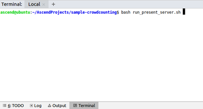

English|[中文](Readme.md)

# Dense Crowd Counting<a name="EN-US_TOPIC_0228461893"></a>

Developers can deploy this application on the Atlas 200 DK or the AI acceleration cloud server to decode local MP4 files or RTSP video streams, predict the number of people in the crowd images, and send the result to the Presenter Server for storage and display.

The applications in the current version branch adapt to  [DDK&RunTime](https://ascend.huawei.com/resources) **1.32.0.0 and later**.

## Prerequisites<a name="section137245294533"></a>

Before deploying this sample, ensure that:

-   Mind Studio  has been installed.
-   The Atlas 200 DK developer board has been connected to  Mind Studio, the cross compiler has been installed, the SD card has been prepared, and basic information has been configured.

## Deployment<a name="section412811285117"></a>

You can use either of the following methods:

1.  Quick deployment: visit  [https://gitee.com/Atlas200DK/faster-deploy](https://gitee.com/Atlas200DK/faster-deploy).

    > **NOTE:**   
    >-   The quick deployment script can be used to deploy multiple samples rapidly. Select  **crowdcounting**.  
    >-   The quick deployment script automatically completes code download, model conversion, and environment variable configuration. To learn about the detailed deployment process, go to:  **[2. Common deployment](#li3208251440)**.  

2.  <a name="li3208251440"></a>Common deployment: visit  [https://gitee.com/Atlas200DK/sample-README/tree/master/sample-crowdcounting](https://gitee.com/Atlas200DK/sample-README/tree/master/sample-crowdcounting).

    > **NOTE:**   
    >-   In this deployment mode, you need to manually download code, convert models, and configure environment variables.  


## Build<a name="section1759513564117"></a>

1.  Open the project.

    Go to the directory that stores the decompressed installation package as the Mind Studio installation user in CLI mode, for example,  **$HOME/MindStudio-ubuntu/bin**. Run the following command to start Mind Studio:

    **./MindStudio.sh**

    Open the  **sample-crowdcounting**  project.

2.  Configure project information in the  **src/param\_configure.conf**  file.

    **Figure  1**  Configuration file path<a name="en-us_topic_0219059426_fig1557065718252"></a>  
    

    

    Content of the configuration file:

    ```
    remote_host=
    presenter_view_app_name=
    video_path_of_host=
    rtsp_video_stream=
    ```

    Parameter settings to be manually added:

    -   **remote\_host**: IP address of the Atlas 200 DK developer board
    -   **presenter\_view\_app\_name**: value of  **View Name**  on the  **Presenter Server**  page, which must be unique. The value consists of 3 to 20 characters and supports only uppercase letters, lowercase letters, digits, and underscores \(\_\).
    -   **video\_path\_of\_host**: absolute path of a video file on the host side
    -   **rtsp\_video\_stream**: URL of RTSP video streams

    Sample of video file configuration:

    ```
    remote_host=192.168.1.2
    presenter_view_app_name=video
    video_path_of_host=/home/HwHiAiUser/car.mp4
    rtsp_video_stream=
    ```

    Sample of RTSP video stream configuration:

    ```
    remote_host=192.168.1.2
    presenter_view_app_name=video
    video_path_of_host=
    rtsp_video_stream=rtsp://192.168.2.37:554/cam/realmonitor?channel=1&subtype=0
    ```

    > **NOTE:**   
    >-   **remote\_host**  and  **presenter\_view\_app\_name**  must be set. Otherwise, the build fails.  
    >-   Do not use double quotation marks \(""\) during parameter settings.  
    >-   Either  **video\_path\_of\_host**  or  **rtsp\_video\_stream**  must be set.  
    >-   Currently, RTSP video streams support only the  **rtsp://ip:port/path**  format. To use URLs in other formats, you need to delete the** IsValidRtsp**  function from the  **video\_decode.cpp**  file or configure the  **IsValidRtsp**  function to directly return  **true**  to skip regular expression matching.  
    >-   The RTSP stream URL provided in this sample cannot be directly used. If RTSP streams are required, create RTSP streams locally either using LIVE555 or other methods, which must support playback in the VLC. Type the URL of the RTSP video streams in the configuration file.  

3.  Run the  **deploy.sh**  script to adjust configuration parameters and download and compile the third-party library. Open the  **Terminal**  window of Mind Studio. By default, the home directory of the code is used. Run the  **deploy.sh**  script in the background to deploy the environment, as shown in  [Figure 2](#en-us_topic_0219059426_fig202009167369).

    **Figure  2**  Running the deploy.sh script<a name="en-us_topic_0219059426_fig202009167369"></a>  
    

    > **NOTE:**   
    >-   During the first deployment, if no third-party library is used, the system automatically downloads and builds the third-party library, which may take a long time. The third-party library can be directly used for the subsequent build.  
    >-   During deployment, select the IP address of the host that communicates with the developer board. Generally, the IP address is the IP address configured for the virtual NIC. If the IP address is in the same network segment as the IP address of the developer board, it is automatically selected for deployment. If they are not in the same network segment, you need to manually type the IP address of the host that communicates with the Atlas DK to complete the deployment.  

4.  Start building. Open Mind Studio and choose  **Build \> Build \> Build-Configuration**  from the main menu. The  **build**  and  **run**  folders are generated in the directory.

    > **NOTICE:**   
    >When you build a project for the first time,  **Build \> Build**  is unavailable. You need to choose  **Build \> Edit Build Configuration**  to set parameters before the build.  

5.  Start Presenter Server.

    Open the  **Terminal**  window of Mind Studio. Under the code storage path, run the following command to start the Presenter Server program of the license crowd counting application on the server, as shown in  [Figure 3](#en-us_topic_0219059426_fig102142024389).

    **bash run\_present\_server.sh**

    **Figure  3**  Starting Presenter Server<a name="en-us_topic_0219059426_fig102142024389"></a>  
    

    

    -   When the message  **Please choose one to show the presenter in browser\(default: 127.0.0.1\):**  is displayed, type the IP address \(usually IP address for accessing Mind Studio\) used for accessing the Presenter Server service in the browser.

        Select the IP address used by the browser to access the Presenter Server service in  **Current environment valid ip list**  and type the path for storing video analysis data, as shown in  [Figure 4](#en-us_topic_0219059426_fig73590910118).

        **Figure  4**  Project deployment<a name="en-us_topic_0219059426_fig73590910118"></a>  
        

        

    [Figure 5](#en-us_topic_0219059426_fig19953175965417)  shows that the Presenter Server service has been started successfully.

    **Figure  5**  Starting the Presenter Server process<a name="en-us_topic_0219059426_fig19953175965417"></a>  
    

    

    Use the URL shown in the preceding figure to log in to Presenter Server \(only Google Chrome is supported\). The IP address is that typed in  [Figure 4](#en-us_topic_0219059426_fig73590910118)  and the default port number is  **7007**. The following figure indicates that Presenter Server has been started successfully.

    **Figure  6**  Home page<a name="en-us_topic_0219059426_fig129539592546"></a>  
    

    The following figure shows the IP address used by Presenter Server and  Mind Studio  to communicate with the Atlas 200 DK.

    **Figure  7**  IP address example<a name="en-us_topic_0219059426_fig195318596543"></a>  
    

    -   The IP address of the Atlas 200 DK developer board is  **192.168.1.2**  \(connected in USB mode\).
    -   The IP address used by Presenter Server to communicate with the Atlas 200 DK is in the same network segment as the IP address of the Atlas 200 DK on the UI Host server. For example:  **192.168.1.223**.
    -   The following describes how to access the IP address \(such as  **10.10.0.1**\) of Presenter Server using a browser. Because Presenter Server and  Mind Studio  are deployed on the same server, you can access  Mind Studio  through the browser using the same IP address.

6.  The crowd counting application can parse local videos and RTSP video streams.
    -   Before parsing a local video, upload the video file to the host.

        For example, upload the video file  **crowd.mp4**  to the  **/home/HwHiAiUser/**  directory on the host.

        > **NOTE:**   
        >H.264 and H.265 MP4 files are supported. If an MP4 file needs to be edited, you are advised to use FFmpeg. If a video file is edited by other tools, FFmpeg may fail to parse the file.  

    -   If only RTSP video streams need to be parsed, skip this step.


## Run<a name="section6245151616426"></a>

1.  Run the crowd counting application.

    On the toolbar of Mind Studio, click  **Run**  and choose  **Run \> Run 'sample-crowdcounting'**. As shown in  [Figure 8](#en-us_topic_0219059426_fig12953163061713), the executable application is running on the developer board.

    **Figure  8**  Application running<a name="en-us_topic_0219059426_fig12953163061713"></a>  
    

    

2.  Use the URL displayed upon the start of the Presenter Server service to log in to Presenter Server. For details, see  [Start Presenter Server](en-us_topic_0219059426.md#li499911453439).

    Wait for Presenter Agent to transmit data to the server. Click  **Refresh**. When there is data, the icon in the  **Status**  column for the corresponding channel changes to green, as shown in  [Figure 9](#en-us_topic_0219059426_fig69382913311).

    **Figure  9**  Presenter Server page<a name="en-us_topic_0219059426_fig69382913311"></a>  
    

    > **NOTE:**   
    >-   For the crowd counting application, Presenter Server supports a maximum of 10 channels at the same time \(each  _presenter\_view\_app\_name_  parameter corresponds to a channel\).  
    >-   Due to hardware limitations, each channel supports a maximum frame rate of 20 fps. A lower frame rate is automatically used when the network bandwidth is low.  

3.  Click a link in the  **View Name**  column, for example,  **video**  in the preceding figure, and view the result.

## Follow-up Operations<a name="section1092612277429"></a>

-   Stopping the crowd counting application

    The crowd counting application is running continually after being executed. To stop it, perform the following operation:

    Click the stop button to stop the crowd counting application. As shown in  [Figure 10](#en-us_topic_0219059426_fig464152917203), the crowd counting application has stopped running.

    **Figure  10**  Stop of the crowd counting application<a name="en-us_topic_0219059426_fig464152917203"></a>  
    

    

-   **Stopping the Presenter Server service**

    The Presenter Server service is always in running state after being started. To stop the Presenter Server service for the crowd counting application, perform the following operations:

    On the server with  Mind Studio  installed, run the following command as the  Mind Studio  installation user to check the process of the Presenter Server service corresponding to the crowd counting application:

    **ps -ef | grep presenter | grep crowd\_counting**

    ```
    ascend@ascend-HP-ProDesk-600-G4-PCI-MT:~/sample-crowdcounting$ ps -ef | grep presenter | grep crowd_counting 
     ascend    7701  1615  0 14:21 pts/8    00:00:00 python3 presenterserver/presenter_server.py --app crowd_counting
    ```

    In the preceding information,  _7701_  indicates the process ID of the Presenter Server service for the crowd counting application.

    To stop the service, run the following command:

    **kill -9** _7701_


