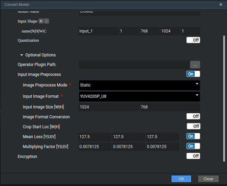

# 密集人群人数统计<a name="ZH-CN_TOPIC_0218788689"></a>

开发者将本应用部署至Atlas 200 DK或者AI加速云服务器上实现对本地mp4文件或者RTSP视频流进行解码，对视频帧中的人群图像进行人头数量的预测，并将预测的结果信息发送至Presenter Server端进行展示。

当前分支中的应用适配**1.1.1.0**与**1.3.0.0**版本的[DDK&RunTime](https://ascend.huawei.com/resources)。

## 前提条件<a name="section137245294533"></a>

部署此Sample前，需要准备好以下环境：

-   已完成Mind Studio的安装。
-   已完成Atlas 200 DK开发者板与Mind Studio的连接，交叉编译器的安装，SD卡的制作及基本信息的配置等。

## 软件准备<a name="section081240125311"></a>

运行此Sample前，需要按照此章节进行相关的环境配置并获取源码包、准备模型文件。

1.  以Mind Studio安装用户登录Mind Studio所在Ubuntu服务器，并设置环境变量。

    **vim \~/.bashrc**

    执行如下命令在最后一行添加DDK\_HOME及LD\_LIBRARY\_PATH的环境变量。

    **export DDK\_HOME=$HOME/tools/che/ddk/ddk**

    **export LD\_LIBRARY\_PATH=$DDK\_HOME/uihost/lib**

    > **说明：**     
    >-   如果此环境变量已经添加，则此步骤可跳过。  

    输入:wq!保存退出。

    执行如下命令使环境变量生效。

    **source \~/.bashrc**

2.  <a name="li953280133816"></a>获取源码包。

    将[https://github.com/Atlas200dk/sample-crowdcounting](https://github.com/Atlas200dk/sample-crowdcounting)仓中的代码以Mind Studio安装用户下载至Mind Studio所在Ubuntu服务器的任意目录，例如代码存放路径为：$HOME/sample-crowdcounting。

3.  <a name="li1365682471610"></a>获取此应用中所需要的原始网络模型。

    参考[表 crowd\_counting中使用模型](#table144841813177)获取此应用中所用到的原始网络模型，并将其存放到Mind Studio所在Ubuntu服务器的任意目录，例如：$HOME/ascend/models/crowdcounting。

    **表 1**  crowd\_counting中使用模型

    <a name="table144841813177"></a>
    <table><thead align="left"><tr id="row161061318181712"><th class="cellrowborder" valign="top" width="13.61%" id="mcps1.2.4.1.1"><p id="p1410671814173"><a name="p1410671814173"></a><a name="p1410671814173"></a>模型名称</p>
    </th>
    <th class="cellrowborder" valign="top" width="10.03%" id="mcps1.2.4.1.2"><p id="p1106118121716"><a name="p1106118121716"></a><a name="p1106118121716"></a>模型说明</p>
    </th>
    <th class="cellrowborder" valign="top" width="76.36%" id="mcps1.2.4.1.3"><p id="p14106218121710"><a name="p14106218121710"></a><a name="p14106218121710"></a>模型下载路径</p>
    </th>
    </tr>
    </thead>
    <tbody><tr id="row1710661814171"><td class="cellrowborder" valign="top" width="13.61%" headers="mcps1.2.4.1.1 "><p id="p13106121801715"><a name="p13106121801715"></a><a name="p13106121801715"></a>crowd_counting</p>
    </td>
    <td class="cellrowborder" valign="top" width="10.03%" headers="mcps1.2.4.1.2 "><p id="p13106171831710"><a name="p13106171831710"></a><a name="p13106171831710"></a>密集人群人数统计网络模型。</p>
    </td>
    <td class="cellrowborder" valign="top" width="76.36%" headers="mcps1.2.4.1.3 "><p id="p110671813170"><a name="p110671813170"></a><a name="p110671813170"></a>请参考<a href="https://github.com/Ascend-Huawei/models/tree/master/computer_vision/object_detect/crowd_counting" target="_blank" rel="noopener noreferrer">https://github.com/Ascend-Huawei/models/tree/master/computer_vision/object_detect/crowd_counting</a>目录中README.md下载原始网络模型文件。</p>
    </td>
    </tr>
    </tbody>
    </table>

4.  将原始网络模型转换为适配昇腾AI处理器的模型。
    1.  在Mind Studio操作界面的顶部菜单栏中选择“Tool \> Convert Model”，进入模型转换界面。
    2.  在弹出的**Convert Model**操作界面中，Model File与Weight File分别选择[步骤3](#li1365682471610)中下载的模型文件和权重文件。

        如[图 crowd\_counting模型转换配置](#fig58411932131319)所示：

        -   Model Name填写为[表 crowd\_counting中使用模型](#table144841813177)中的模型名称：**crowd\_counting**。
        -   其他参数保持默认值。

            **图 1**  crowd\_counting模型转换配置<a name="fig58411932131319"></a>  
            

            

            单击“OK“开始模型转换。

            模型转换成功后，转换好的后缀为.om的模型文件存放地址为：$HOME/tools/che/model-zoo/my-model/crowd\_counting。


5.  将转换好的模型文件（.om文件）上传到[步骤2](#li953280133816)中源码所在路径下的“sample-crowdcounting/script”目录下。

## 部署<a name="section7994174585917"></a>

1.  以Mind Studio安装用户进入密集人数统计应用代码所在根目录，如：$HOME/sample-crowdcounting。
2.  <a name="li9634105881418"></a>执行部署脚本，进行工程环境准备，包括ascenddk公共库的编译与部署、Presenter Server服务器的配置等操作，其中Presenter Server用于接收Application发送过来的数据并通过浏览器进行结果展示。

    **bash deploy.sh** _host\_ip_ _model\_mode_

    -   _host\_ip_：Atlas 200 DK开发者板的IP地址。
    -   model\_mode代表模型文件及依赖软件的部署方式，默认为internet。
        -   **local**：若Mind Studio所在Ubuntu系统未连接网络，请使用local模式，执行此命令前，需要参考[依赖代码库下载](#section4995103618210)将依赖的公共代码库下载到“sample-crowdcounting/script“目录下。
        -   **internet**：若Mind Studio所在Ubuntu系统已连接网络，请使用internet模式，在线下载依赖代码库。

    命令示例：

    **bash deploy.sh 192.168.1.2 internet**

    当提示“Please choose one to show the presenter in browser\(default: 127.0.0.1\):“时，请输入在浏览器中访问Presenter Server服务所使用的IP地址（一般为访问Mind Studio的IP地址。）

    如[图2](#fig184321447181017)所示，请在“Current environment valid ip list“中选择通过浏览器访问Presenter Server服务使用的IP地址。

    **图 2**  工程部署示意图<a name="fig184321447181017"></a>  
    

3.  <a name="li499911453439"></a>启动Presenter Server。

    执行如下命令在后台启动密集人群人数统计应用的Presenter Server主程序。

    **python3 presenterserver/presenter\_server.py --app crowd\_counting &**

    > **说明：**   
    >“presenter\_server.py“在当前目录的“presenterserver“目录下，可以在此目录下执行**python3 presenter\_server.py -h**或者**python3 presenter\_server.py --help**查看“presenter\_server.py“的使用方法。  

    如[图3](#fig69531305324)所示，表示presenter\_server的服务启动成功。

    **图 3**  Presenter Server进程启动<a name="fig69531305324"></a>  
    

    使用上图提示的URL登录Presenter Server，仅支持Chrome浏览器。IP地址为[步骤2](#li9634105881418)中输入的IP地址，端口号默为7011，如下图所示，表示Presenter Server启动成功。

    **图 4**  主页显示<a name="fig64391558352"></a>  
    

    Presenter Server、Mind Studio与Atlas 200 DK之间通信使用的IP地址示例如下图所示：

    **图 5**  IP地址示例<a name="fig1881532172010"></a>  
    

    其中：

    -   Atlas 200 DK开发者板使用的IP地址为192.168.1.2（USB方式连接）。
    -   Presenter Server与Atlas 200 DK通信的IP地址为UI Host服务器中与Atlas 200 DK在同一网段的IP地址，例如：192.168.1.223。
    -   通过浏览器访问Presenter Server的IP地址本示例为：10.10.0.1，由于Presenter Server与Mind Studio部署在同一服务器，此IP地址也为通过浏览器访问Mind Studio的IP。

4.  密集人数统计应用支持解析本地视频和RTSP视频流。
    -   如果需要解析本地视频，需要将视频文件传到Host侧。

        例如将视频文件crowd.mp4上传到Host侧的“/home/HwHiAiUser/sample“目录下。

        > **说明：**   
        >支持H264与H265格式的MP4文件，如果MP4文件需要剪辑，建议使用开源工具ffmpeg，使用其他工具剪辑的视频文件ffmpeg工具可能不支持解析。  

    -   如果仅解析RTSP视频流，本步骤可跳过。


## 运行<a name="section551710297235"></a>

1.  运行密集人数统计应用程序。

    在**sample-crowdcounting**目录下执行如下命令运行crowdcounting应用程序。

    **bash run\_crowdcountingapp.sh** _host\_ip presenter\_view\_appname channel1 \[channel2\]_  &

    -   _host\_ip_：对于Atlas 200 DK开发者板，即为开发者板的IP地址。对于AI加速云服务器，即为Host侧的IP地址。
    -   _presenter\_view\_app\_name_：用户自定义的在PresenterServer界面展示的View Name，此View Name需要在Presenter Server展示界面唯一，只能为大小写字母、数字、“/”的组合，位数至少1位。
    -   channel1：为Host侧的视频文件的绝对路径，需要加上双引号。当只存在视频文件时，Channel2可以省略。
    -   channel2：为RTSP视频流的URL，需要加上双引号。当只存在RTSP视频流时需要使用” ”对channel1进行占位。

    视频文件运行的命令示例如下所示：

    **bash run\_crowdcountingapp.sh 192.168.1.2 video "/home/HwHiAiUser/sample/crowd.mp4" &**

    RTSP视频流的命令实例如下所示：

    **bash run\_crowdcountingapp.sh 192.168.1.2 video " " "rtsp://192.168.2.37:554/cam/realmonitor?channel=1&subtype=0" &**

    > **说明：**   
    >-   当前RTSP视频流只支持rtsp://ip:port/path格式，如果需要使用其它格式的url，需要把video\_decode.cpp中的IsValidRtsp函数去除，或者直接返回true，跳过正则表达式匹配。  
    >-   当前应用仅支持MP4文件或RTSP单独运行，即Channel-1和Channel-2不能同时填，需要一起运行则需要单独执行两次run脚本。  

2.  使用启动Presenter Server服务时提示的URL登录 Presenter Server 网站，详细可参考[3](#li499911453439)。

    等待Presenter Agent传输数据给服务端，单击“Refresh“刷新，当有数据时相应的Channel 的Status变成绿色，如[图6](#fig113691556202312)所示。

    **图 6**  Presenter Server界面<a name="fig113691556202312"></a>  
    

    > **说明：**   
    >-   Crowd Counting的Presenter Server最多支持10路Channel同时显示，每个  _presenter\_view\_app\_name_  对应一路Channel。  
    >-   由于硬件的限制，每一路支持的最大帧率是20fps，受限于网络带宽的影响，帧率会自动适配为较低的帧率进行展示。  

3.  单击右侧对应的View Name链接，比如上图的“video”，查看结果。

## 后续处理<a name="section177619345260"></a>

-   **停止密集人群人数统计应用**

    若要停止密集人群人数统计应用程序，可执行如下操作。

    以Mind Studio安装用户在$HOME/sample-crowdcounting目录下执行如下命令：

    **bash stop\_crowdcountingapp.sh** _host\_ip_

    _host\_ip_：对于Atlas 200 DK开发者板，即为开发者板的IP地址。对于AI加速云服务器，即为Host的IP地址。

    命令示例：

    **bash stop\_crowdcountingapp.sh 192.168.1.2**

-   **停止Presenter Server服务**

    Presenter Server服务启动后会一直处于运行状态，若想停止密集人群人数统计应用对应的Presenter Server服务，可执行如下操作。

    以Mind Studio安装用户在Mind Studio所在服务器中执行如下命令查看密集人群人数统计应用对应的Presenter Server服务的进程。

    **ps -ef | grep presenter | grep crowd\_counting**

    ```
    ascend@ascend-HP-ProDesk-600-G4-PCI-MT:~/sample-_crowdcounting$ ps -ef | grep presenter | grep crowd_counting
    ascend    7701  1615  0 14:21 pts/8    00:00:00 python3 presenterserver/presenter_server.py --app crowd_counting
    ```

    如上所示  _7701_  即为密集人群人数统计应用对应的Presenter Server服务的进程ID。

    若想停止此服务，执行如下命令：

    **kill -9** _7701_


## 依赖代码库下载<a name="section4995103618210"></a>

将依赖的软件库下载到“sample-crowdcounting/script“目录下。

**表 2**  依赖代码库下载

<a name="table9491163455810"></a>
<table><thead align="left"><tr id="row1949214345587"><th class="cellrowborder" valign="top" width="33.33333333333333%" id="mcps1.2.4.1.1"><p id="p164921034205816"><a name="p164921034205816"></a><a name="p164921034205816"></a>模块名称</p>
</th>
<th class="cellrowborder" valign="top" width="33.33333333333333%" id="mcps1.2.4.1.2"><p id="p7493173475818"><a name="p7493173475818"></a><a name="p7493173475818"></a>模块描述</p>
</th>
<th class="cellrowborder" valign="top" width="33.33333333333333%" id="mcps1.2.4.1.3"><p id="p18493133420580"><a name="p18493133420580"></a><a name="p18493133420580"></a>下载地址</p>
</th>
</tr>
</thead>
<tbody><tr id="row449315344589"><td class="cellrowborder" valign="top" width="33.33333333333333%" headers="mcps1.2.4.1.1 "><p id="p144931334165819"><a name="p144931334165819"></a><a name="p144931334165819"></a>EZDVPP</p>
</td>
<td class="cellrowborder" valign="top" width="33.33333333333333%" headers="mcps1.2.4.1.2 "><p id="p349393413588"><a name="p349393413588"></a><a name="p349393413588"></a>对DVPP接口进行了封装，提供对图片/视频的处理能力。</p>
</td>
<td class="cellrowborder" valign="top" width="33.33333333333333%" headers="mcps1.2.4.1.3 "><p id="p31774315318"><a name="p31774315318"></a><a name="p31774315318"></a><a href="https://github.com/Atlas200dk/sdk-ezdvpp" target="_blank" rel="noopener noreferrer">https://github.com/Atlas200dk/sdk-ezdvpp</a></p>
<p id="p1634523015710"><a name="p1634523015710"></a><a name="p1634523015710"></a>下载后请保持文件夹名称为ezdvpp。</p>
</td>
</tr>
<tr id="row134936341585"><td class="cellrowborder" valign="top" width="33.33333333333333%" headers="mcps1.2.4.1.1 "><p id="p194932344585"><a name="p194932344585"></a><a name="p194932344585"></a>Presenter Agent</p>
</td>
<td class="cellrowborder" valign="top" width="33.33333333333333%" headers="mcps1.2.4.1.2 "><p id="p5493634115811"><a name="p5493634115811"></a><a name="p5493634115811"></a>与Presenter Server进行交互的API接口。</p>
</td>
<td class="cellrowborder" valign="top" width="33.33333333333333%" headers="mcps1.2.4.1.3 "><p id="p159001719179"><a name="p159001719179"></a><a name="p159001719179"></a><a href="https://github.com/Atlas200dk/sdk-presenter/tree/master" target="_blank" rel="noopener noreferrer">https://github.com/Atlas200dk/sdk-presenter/tree/master</a></p>
<p id="p147584116910"><a name="p147584116910"></a><a name="p147584116910"></a>请获取此路径下的presenteragent文件夹，下载后请保持文件夹名称为presenteragent。</p>
</td>
</tr>
<tr id="row2049413455810"><td class="cellrowborder" valign="top" width="33.33333333333333%" headers="mcps1.2.4.1.1 "><p id="p15494183414589"><a name="p15494183414589"></a><a name="p15494183414589"></a>tornado (5.1.0)</p>
<p id="p04941634185812"><a name="p04941634185812"></a><a name="p04941634185812"></a>protobuf (3.5.1)</p>
<p id="p2049418342580"><a name="p2049418342580"></a><a name="p2049418342580"></a>numpy (1.14.2)</p>
</td>
<td class="cellrowborder" valign="top" width="33.33333333333333%" headers="mcps1.2.4.1.2 "><p id="p24941634175814"><a name="p24941634175814"></a><a name="p24941634175814"></a>Presenter Server依赖的Python库</p>
</td>
<td class="cellrowborder" valign="top" width="33.33333333333333%" headers="mcps1.2.4.1.3 "><p id="p1349493405810"><a name="p1349493405810"></a><a name="p1349493405810"></a>可以在python官网<a href="https://pypi.org/" target="_blank" rel="noopener noreferrer">https://pypi.org/</a>上搜索相关包进行安装。</p>
<p id="p84941034135812"><a name="p84941034135812"></a><a name="p84941034135812"></a>若使用pip3 install命令在线下载，可以使用如下命令指定相关版本进行下载，例如：</p>
<p id="p3494734185814"><a name="p3494734185814"></a><a name="p3494734185814"></a>pip3 install tornado==5.1.0  -i  <em id="i12494113495819"><a name="i12494113495819"></a><a name="i12494113495819"></a>指定库的安装源</em>  --trusted-host  <em id="i8494153413586"><a name="i8494153413586"></a><a name="i8494153413586"></a>安装源的主机名</em></p>
</td>
</tr>
</tbody>
</table>

